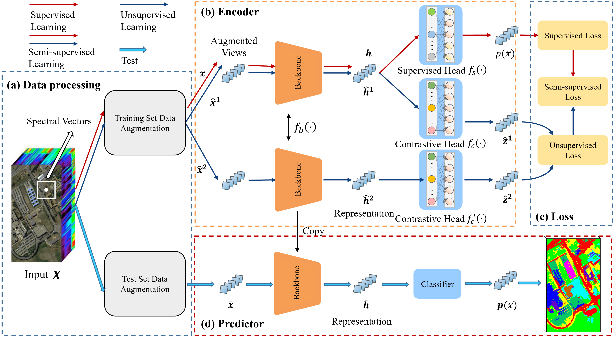

# A Universal Knowledge Embedded Contrastive Learning  Framework for Hyperspectral Image Classification

Hyperspectral image (HSI) classification techniques have been intensively studied, and a variety of models have been developed. However, these HSI classification models are limited to lightweight models and random sampling methods of partitioning the datasets. The former constrains the model’s generalization performance, and the latter leads to inflated model evaluation metrics, which result in plummeting model performance in the real world. Therefore, we propose a universal Knowledge-Embedded Contrastive Learning (KnowCL) method for HSI classification that learns invariant features in the absence of globally distributed training samples. We present a new HSI processing pipeline, along with a range of data transformation and augmentation techniques that yield diverse data representations. The proposed framework based on this pipeline is compatible with supervised, semi-supervised, and unsupervised learning. The semi-supervised version can fully exploit labeled and unlabeled samples with the expected training time. Furthermore, we designed a new loss function that adaptively fuses supervised and unsupervised losses, thereby enhancing learning performance. This proposed new classification paradigm shows great potential in exploring HSI classification technology on disjoint sampling. The code can be accessed at https://github.com/quanweiliu/KnowCL.

### Project description

This code has a very simple structure. Below are the four notebook files for Donio, Houston 2018, Salinas, and University of Pavia, respectively. They contain training, testing and visulization.
- main_awl3_D.ipynb
- main_awl3_D8.ipynb
- main_awl3_S.ipynb
- main_awl3_U.ipynb

To run this code, download the corresponding datasets, then run the files above to get the experimental results.

### Friend links:
- If you are interested in hyperspectral image classification, pixel-based classification, or information fusion, feel free to refer to [PatchwiseClsFra](https://github.com/quanweiliu/PatchwiseClsFra).
- If you are interested in image semantic segmentation or information fusion, feel free to refer to [TilewiseSegFra](https://github.com/quanweiliu/TilewiseSegFra).
- If you are interested in referring image semantic segmentation, feel free to refer to [ReferringSegFra](https://github.com/quanweiliu/ReferringSegFra).

